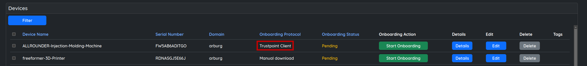
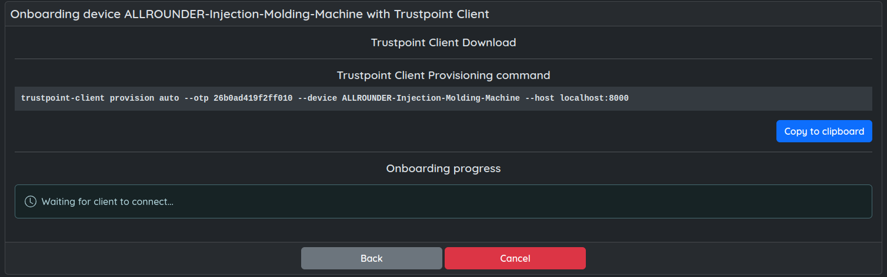
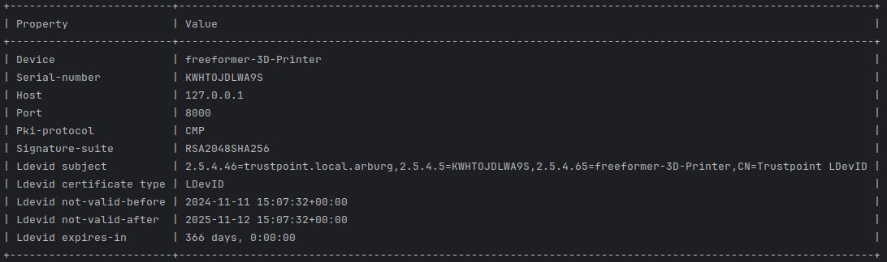

Quickstart
==========

This guide describes how to install the Trustpoint-Client and utilize it to request the first application certificate.

|

Installation
------------

We recommend using pipx (or pip) to install the Trustpoint-Client.

System Requirements
...................

To install and use the Trustpoint-Client you will need at least the following.

    - python >= 3.10
    - pipx / pip

Installation using pipx or pip
..............................

.. code-block:: bash

    pipx install trustpoint-client

Alternatives using PIP depending on the OS and environment:

.. code-block:: bash

    pip install trustpoint-client
    pip3 install trustpoint-client

.. note::

    If you would like to rather clone the GIT repository, maybe to use try the latest changes on main,
    pleaser refer to the README.md in the corresponding repository:

    - `Trustpoint-Client <https://github.com/TrustPoint-Project/trustpoint-client>`_.
    - `Trustpoint-DevID-Module <https://github.com/TrustPoint-Project/trustpoint-devid-module>`_.

    You will require to use the Trustpoint-Client as python package using one of the following

    .. code-block:: bash

        python -m trustpoint-client
        python3 -m trustpoint-client

|

Check the installation
~~~~~~~~~~~~~~~~~~~~~~

Two new commands should now be available:

.. code-block:: bash

    trustpoint-devid-module
    trustpoint-client

The trustpoint-devid-module is responsible for handling and storing certificates and secrets and provides an API
as described IEEE 802.1 AR DevIDModule. This command should usually not be needed or be used. The Trustpoint-Client
wraps this library and provides higher level functions and features.

|

Onboarding the device
~~~~~~~~~~~~~~~~~~~~~

Navigate to the Trustpoint GUI. You need to create or select a device abstraction in the Trustpoint which
represents this device to be onboarded. The Trustpoint-Client must be configured as Onboarding Protocol.

|

|

Navigate to onboarding. This will provide you with the needed command to onboard the device.
Copy it to clipboard if possible or enter it manually on the device.

|

|

After executing the command, the Trustpoint-Client should be onboarded and list information like the following.

|

|

The Trustpoint-Client (device) is now onboarded and possesses a domain credential to request and manage
application certificates.

We now want to create both a TLS client and server certificate.

We want to refer to the TLS client certificate in the future as my-tls-client-cert and thus provide the client with
this unique name (handle) when requesting the new certificate:

.. code-block:: bash

    trustpoint-client credentials request tls-client my-new-tls-client-cert

.. code-block:: bash

    trustpoint-client credentials request tls-server --san-ip 192.168.5.1 --san-domain test.trustpoint.org my-new-tls-server-cert

.. code-block:: bash

    trustpoint-client credentials export credential -u my-new-tls-client-cert -o my-new-tls-server-cert.p12

.. code-block:: bash

    trustpoint-client credentials export credential -u my-new-tls-server-cert -o my-new-tls-server-cert.p12
