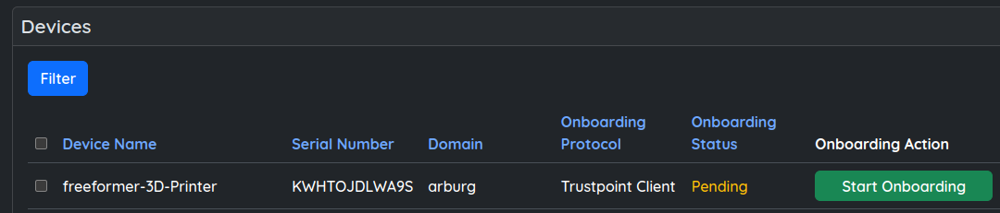
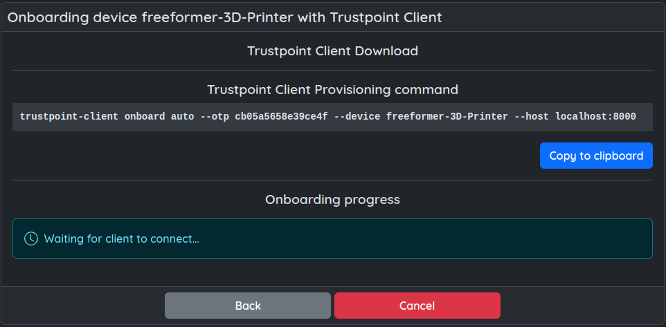

Quickstart
==========

This guide describes how to install the Trustpoint-Client and utilize it to request the first application certificate.

|

Installation
------------

We recommend using pipx (or pip) to install the Trustpoint-Client.

System Requirements
...................

To install and use the Trustpoint-Client you will need at least the following.

    - python >= 3.10
    - pipx / pip

Installation using pipx or pip
..............................

.. code-block:: text

    pipx install trustpoint-client

Alternatives using PIP depending on the OS and environment:

.. code-block:: text

    pip install trustpoint-client
    pip3 install trustpoint-client

.. note::

    If you would like to rather clone the GIT repository, maybe to use try the latest changes on main,
    pleaser refer to the README.md in the corresponding repository:

    - `Trustpoint-Client <https://github.com/TrustPoint-Project/trustpoint-client>`_.
    - `Trustpoint-DevID-Module <https://github.com/TrustPoint-Project/trustpoint-devid-module>`_.

    You will require to use the Trustpoint-Client as python package using one of the following

    .. code-block:: text

        python -m trustpoint-client
        python3 -m trustpoint-client

|

Check the installation
~~~~~~~~~~~~~~~~~~~~~~

Two new commands should now be available:

.. code-block:: text

    trustpoint-devid-module
    trustpoint-client

The trustpoint-devid-module is responsible for handling and storing certificates and secrets and provides an API
as described IEEE 802.1 AR DevIDModule. This command should usually not be needed or be used. The Trustpoint-Client
wraps this library and provides higher level functions and features.

|

Onboarding the device
~~~~~~~~~~~~~~~~~~~~~

Navigate to the Trustpoint GUI. You need to create or select a device abstraction in the Trustpoint which
represents the device to be onboarded.
In this Quickstart Guide we are using 'Demo-Data' which can be ... TODO

After injecting the 'Demo-Data', we can arbitrarily choose a device which is configured to use
the 'Trustpoint Client' as 'Onboarding Protocol'.

In our example, we want to onboard our Trustpoint-Client representing the freeformer-3D-Printer device, as depicted
in the figure below.

|

|

Now, click on the 'Start Onboarding' button. This will provide you with the needed command to onboard the device.
Copy it to clipboard if possible or enter it manually on the device.

|

|

Executing this command, will onboard the Trustpoint-Client, that is the device.
You can expect information like the following to be printed to stdout.

|

.. image:: _static/quickstart-onboarded.png
    :align: center

|

The Trustpoint-Client (device) is now onboarded and possesses a domain credential to request and manage
application certificates.

|
|

We can now request application certificates.
In this example we want to issue both a TLS-Client and TLS-Server certificate.

We choose some unique names (handles) to refer to those certificates in the future:

- TLS-Client : my-tls-client-cert
- TLS-Server : my-tls-server-cert

|

Now, to request a TlS-Client certificate we can use the following command:

.. code-block:: text

    trustpoint-client credentials request tls-client my-new-tls-client-cert

|

This should result in output like the following:

|

And we will also request our TLS-Server credential.

.. code-block:: text

    trustpoint-client credentials request tls-server --san-ip 192.168.5.1 --san-domain test.trustpoint.org my-new-tls-server-cert

|

|

We now have two application credentials available, namely, my-tls-client-cert and my-tls-server-cert.
We can list it on the CLI (excluding the private key). If we add --verbose or -verbosity, we will also get the PEM
encoding certificate, certificate chain and public key.

|

.. code-block:: text

    trustpoint-client credentials list credential my-tls-client-cert -v

|

To actually use the credential, currently the only option is to export the credential. The following commands
will store the credential in the given file path (--pkcs12-out, -o). If no password is provided, it will automatically
generate a secure password and echo it to stdout.

.. code-block:: text

    trustpoint-client credentials export credential -u my-tls-client-cert -o my-tls-client-cert.p12

.. code-block:: text

    trustpoint-client credentials export credential -u my-tls-server-cert -o my-tls-server-cert.p12

|

It is also possible to only export the certificate, certificate chain, private and/or public key separately
in different formats. Use the --help flag to discover all possible options:

.. code-block:: text

    trustpoint-client credentials export --help

|

.. Note:

    This concludes the Quickstart-Guide. We invite you to examine the Trustpoint-Client further and to discover all its
    features. Using the --help flag should provide all required information to get a feel of the current features and
    support.

|